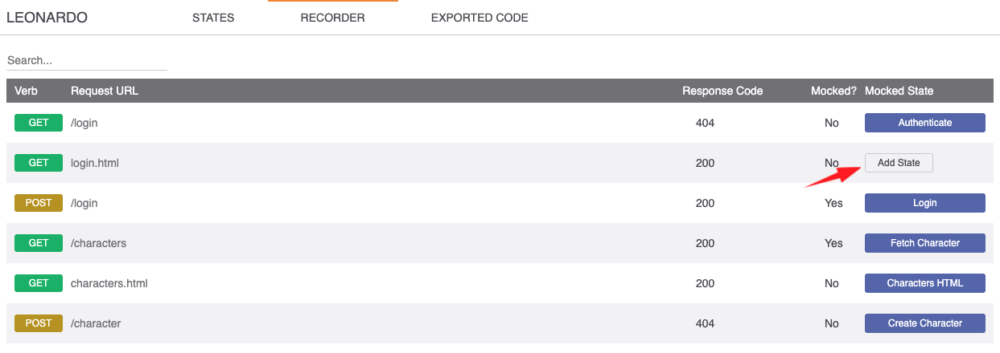
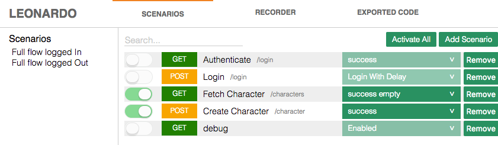
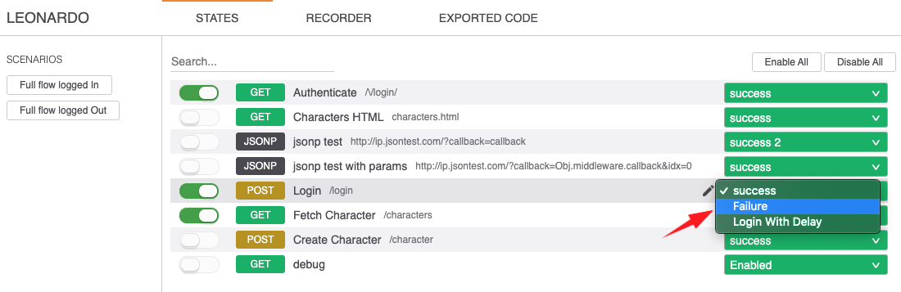

<h1 align="center">
  
  <br>
  Leonardo
</h1>
<p align="center">
  <br>
  <a href="https://travis-ci.org/outbrain/Leonardo"
    ></a>
  <a href="http://badge.fury.io/js/leonardojs"
    ></a>
  <a href="http://packagequality.com/#?package=leonardojs"
    ></a>
  <br>
  Client side mocking for the server side
</p>

## Install

### npm

```bash
$ npm install leonardojs --save-dev
```
## Example

[Full Application Example](http://outbrain.github.io/Leonardo/examples/angularIL/)

[AngularJS Israel conference (hebrew)](http://www.youtube.com/watch?v=zPBmMiJZ5O8)

# Getting Started

## 1. Add Leonardo script

### Require in your code

```javascript
    // in dev environment
    import 'leonardojs';
```

### Or directly in html
```html
 <!DOCTYPE HTML>
 <html>
 <body>
   //.....
   <script src="[node_modules|other]/leonardo/dist/leonardo.js"></script>
 </body>
 </html>
```

## 2. Run your app
You should now see Leonardo's icon on the bottom right corner. Click It.

## 3. Start mocking your http calls via the recorder tab 


## 4. Turn your mocking on and off as you wish


## 5. Change your responses as you wish


## Javascript API
Automate your mocks using Leonardo's API

**State**:
- name: (string) State name, must be unique
- url: (string) request url, treated as regex
- verb: (string) request http verb
- options (StateOption array)

**StateOption**:
- name: (string) option name
- status: (number) http status code
- data: (primitive | Object | Function) the data to be returned in response body. 
    - Use function to dynamically control the response (first parameter is the request object).


### Add States
`addState(State array)`
```javascript
 //.....
    Leonardo.addStates([
        {
          name: 'Get Data',
          url: '/api/user/43435',
          verb: 'GET',
          options: [
            {name: 'success', status: 200, data: { name: "Master Splinter" }},
            {name: 'error 500', status: 500}
          ]
        },{
          name: 'Get Data',
          url: '/api/user/43435',
          verb: 'GET',
          options: [
            {name: 'success', status: 200, data: { name: "Master Splinter" }},
            {name: 'error 500', status: 500}
          ]
        },
        {
          name: 'Get Characters',
          url: '/api/character',
          verb: 'GET',
          options: [
            {
              name: 'success', 
              status: 200,
              data: function(request) {
                if (request.url.indexOf('term=Donatello') > 0) {
                  return { name: "Donatello" };
                } else {
                  return { name: "Raphael" };                  
                }
              }
            },
          ]
        }
  ]);
```

### Activate State Option
`activateStateOption(stateName, optionName)`

Activates state option, mocked response will be returned when calling the state url

```javascript
//.....
    Leonardo.activateStateOption('Update Data', 'success');
    $http.put('/api/user/43435', { name: "Master Splinter" }).success(function(data, status) {
        console.log(status); // 200 
    });
    
    Leonardo.activateStateOption('Update Data', 'error 500');
    $http.put('/api/user/43435', { name: "Master Splinter" }).error(function(data, status) {
        console.log(status); // 500 
    });
//.....
```

### Deactivate State
`deactivateState(stateName)`

Deactivates a specific state, when calling the state url request will pass through to the server

```javascript
//.....
    Leonardo.deactivateState('Update Data');
//.....
```

### Hide/Show Leonardo icon
You can hide Leonardo activator icon by clicking `ctrl` + `shift` + `l`.

