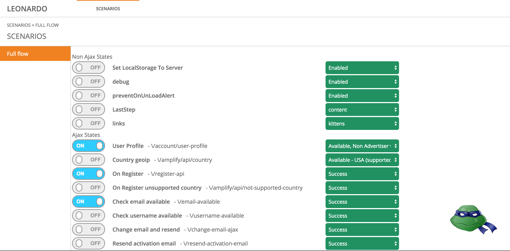

## Leonardo

[](http://badge.fury.io/js/leonardojs)
[](http://badge.fury.io/bo/leonardo)

[](http://packagequality.com/#?package=leonardojs)



[Demo](http://outbrain.github.io/Leonardo/)


## Install

__Dependencies__

* __[Angular](https://github.com/angular/bower-angular)__
* __[Angular Mocks](https://github.com/angular/bower-angular-mocks)__

Installing via `npm` or `bower` will bring in the above dependencies as well.

__npm__
```sh
$ npm install leonardojs
```

__bower__
```sh
$ bower install leonardo
```

#### Load Dependency scripts

Angular (tested with v1.3)
Angular Mocks module  (tested with v1.3)

#### Load Leonardo script

```html
<!DOCTYPE HTML>
<html>
<body ng-app="app">
  //.....
  <script src="[bower_componenets|node_modules|other]/angular/angular.js"></script>
  <script src="[bower_componenets|node_modules|other]/angular-mocks/angular-mocks.js"></script>
  //.....
  <script src="[bower_componenets|node_modules|other]/leonardo/leonardo.js"></script>
</body>
</html>
```

#### Load Leonardo css

```html
<!DOCTYPE HTML>
<html>
<head>
  //.....
  <link rel="stylesheet" media="all" href="[bower_componenets|node_modules|other]/leonardo/leonardo.min.css" />
</head>
</html>
```

#### Add Angular module dependency

```html
<!DOCTYPE HTML>
<html>
<body ng-app="app">
  //.....
   <script>
    var myApp = angular.module("app", ["leonardo"]);
    //.....    
   </script>
</body>
</html>
```
#### Add Attribute For UI Activation Via Icon

```html
<!DOCTYPE HTML>
<html>
<body ng-app="app" leo-activator>
  //.....
</body>
</html>
```

## API
#### Add States
```javascript
 //.....
    myApp.run(["leoConfiguration", function(leoConfiguration){
      leoConfiguration.addStates([
        {
          name: 'Get Data',
          url: '/api/user/43435',
          options: [
            {name: 'success', status: 200, data: { name: "Master Splinter" }},
            {name: 'error 500', status: 500},
            {name: 'error 401', status: 401}
          ]
        },
        {
          name: 'Update Data',
          url: '/api/user/43435',
          verb: 'PUT',
          options: [
            {name: 'success', status: 200},
            {name: 'error 500', status: 500},
            {name: 'error 400', status: 400}
          ]
        }
      ]);
    }]);
```

#### Activate State Option
Activates state option, mocked response will be returned when calling the state url
```javascript
//.....
    leoConfiguration.activateStateOption('Update Data', 'success');
    $http.put('/api/user/43435', { name: "Master Splinter" }).success(function(data, status) {
        console.log(status); // 200 
    });
    
    leoConfiguration.activateStateOption('Update Data', 'error 500');
    $http.put('/api/user/43435', { name: "Master Splinter" }).error(function(data, status) {
        console.log(status); // 500 
    });
//.....
```

#### Deactivate State
Deactivates a specific state, when calling the state url request will pass through to the server
```javascript
//.....
    leoConfiguration.deactivateState('Update Data');
//.....
```

## Documentation
http://outbrain.github.io/Leonardo/docs/configuration.srv.html


## Running and contributing

#### Compile

`cd` into the project folder

```bash
npm run compile
```

This compiles the code as well as documentation.

#### Auto Recompile

To automatically recompile the files on each change run

```bash
npm run compile:watch
```

Note that this does not recompile the documentation.

Note that this does not auto-refreshes the browser.

#### Compile Documentation

Running `npm run compile` compiles the documentation. But if you need to recompile it later also,
(for example when running with `gulp watch`) run

```bash
npm run compile:docs
```

#### Running

Run local server and navigate to `index.html`.

or `cd` into the project folder

```bash
gulp serve
```

## License
Copyright &copy; 2015 MIT License
